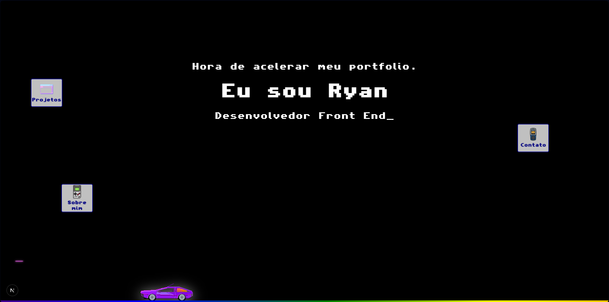

# Meu Portfolio 🚀

Meu portfolio interativo feito com **Next.js**, inspirado em uma estética retrô arcade / Windows 98 baseado no site do The Strokes, com carro animado, efeitos de parallax e janelas flutuantes para Projetos, Sobre mim e Contato.

---

## ✨ Funcionalidades

- Hero animado com carro em movimento e speed lines
- Barra RGB com animação contínua
- Janela estilo Windows 98 para Projetos, Sobre mim e Contato
- Integração com GitHub para exibir repositórios em tempo real
- Efeitos interativos com hover e animações suaves
- Layout responsivo para desktop

---

## 🛠 Tecnologias

- [Next.js](https://nextjs.org/)
- [React](https://reactjs.org/)
- [TypeScript](https://www.typescriptlang.org/)
- [Styled Components](https://styled-components.com/)
- HTML, CSS, JavaScript

---

## 👨‍💻 Sobre mim

Sou estudante de Análise e Desenvolvimento de Sistemas e atuo como Analista de TI na Kem Distribuidora. Sou entusiasta em **Frontend**, **Cybersegurança** e design interativo.

---

## 📂 Estrutura do projeto
app/
├─ page.tsx
├─ components/
│ ├─ Hero.tsx
│ ├─ Portfolio.tsx
│ └─ RetroWindow.tsx
public/
├─ images/
├─ icons/
├─ fonts/

---

## 🔗 Contato

- Email: ryanlizzebroilo@gmail.com
- Instagram: [@ryanlbroilo](https://www.instagram.com/ryanlbroilo)
- LinkedIn: [Ryan Lizze Broilo](https://br.linkedin.com/in/ryan-lizze-broilo-737102209)
- GitHub: [ryanlbroilo](https://github.com/ryanlbroilo)

---

## 🌐 Deploy

Você pode acessar a versão online do portfolio [aqui]([https://ryanlbroilo.github.io/my-portfolio](https://my-portfolio-wheat-rho-12.vercel.app))

